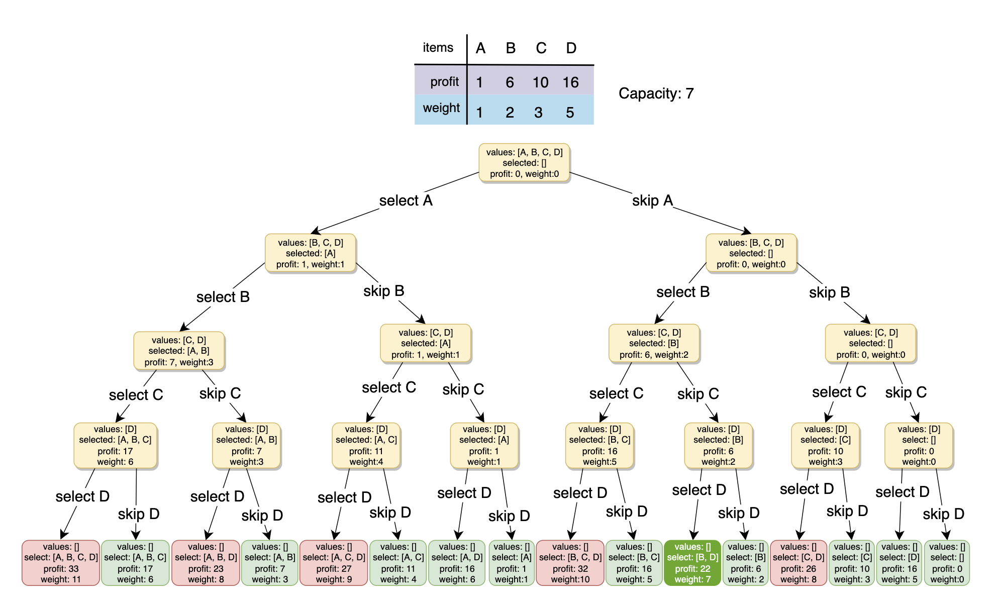
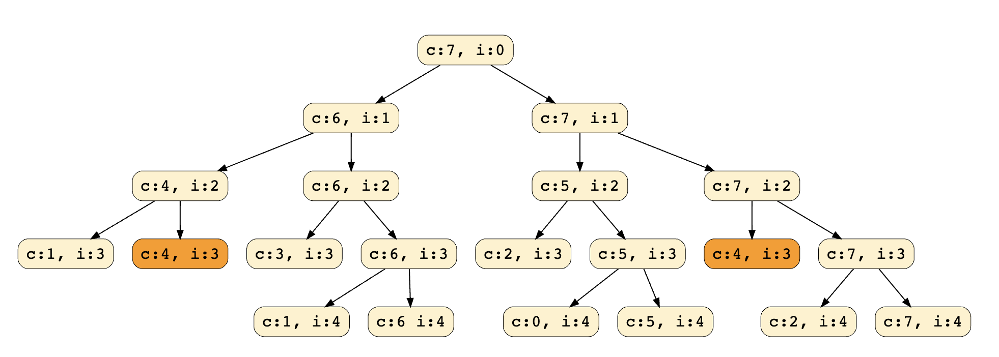
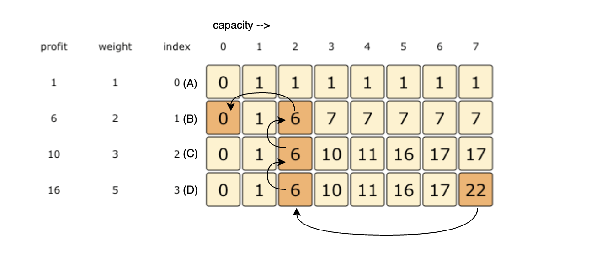

# Pattern 15: 0-1 Knapsack (Dynamic Programming)

<b>0/1 Knapsack pattern</b> is based on the famous problem with the same name which is efficiently solved using <b>Dynamic Programming (DP)</b>.

In this pattern, we will go through a set of problems to develop an understanding of <b>DP</b>. We will always start with a brute-force recursive solution to see the overlapping subproblems, i.e., realizing that we are solving the same problems repeatedly.

After the recursive solution, we will modify our algorithm to apply advanced techniques of <b>Memoization</b> and <b>Bottom-Up Dynamic Programming</b> to develop a complete understanding of this pattern.

Let’s jump onto our first problem.

## 0/1 Knapsack (medium)
https://leetcode.com/problems/maximum-earnings-from-taxi/

 > Given the weights and profits of `N` items, we are asked to put these items in a knapsack with a capacity `C`. The goal is to get the `maximum profit` out of the knapsack items. Each item can only be selected once, as we don’t have multiple quantities of any item.

Let’s take Merry’s example, who wants to carry some fruits in the knapsack to get `maximum profit`. Here are the weights and profits of the fruits:
- `Items: { Apple, Orange, Banana, Melon }`
- `Weights: { 2, 3, 1, 4 }`
- `Profits: { 4, 5, 3, 7 }`
- `Knapsack capacity: 5`

Let’s try to put various combinations of fruits in the knapsack, such that their total weight is not more than `5`:
- `Apple + Orange (total weight 5) => 9 profit`
- `Apple + Banana (total weight 3) => 7 profit`
- `Orange + Banana (total weight 4) => 8 profit`
- `Banana + Melon (total weight 5) => 10 profit`

This shows that `Banana + Melon` is the best combination as it gives us the `maximum profit`, and the total weight does not exceed the capacity.
#
> Given two integer arrays to represent weights and profits of `N` items, we need to find a subset of these items which will give us maximum profit such that their cumulative weight is not more than a given number `C`. Each item can only be selected once, which means either we put an item in the knapsack or we skip it.

A basic <b>brute-force solution</b> could be to try all combinations of the given items (as we did above), allowing us to choose the one with `maximum profit` and a weight that doesn’t exceed `C`. Take the example of four items `A, B, C, and D`, as shown in the diagram below. To try all the combinations, our algorithm will look like:


All <b>green boxes</b> have a total weight that is less than or equal to the capacity `7`, and all the <b>red ones</b> have a weight that is more than `7`. The best solution we have is with items `[B, D]` having a total profit of `22` and a total weight of `7`.


### Brute-Force Solution
````
function solveKnapsack(profits, weights, capacity) {
  
  function knapsackRecursive(profits, wights, capacity, currentIndex){
    //check base case
    if(capacity <= 0 || currentIndex >= profits.length) return 0
    
    //recursive call after choosing the element at currentIndex
    // create a new set which INCLUDES item at currentIndex if the total weight does not exceed the capacity, and 
    let currentProfit = 0
    
    if(weights[currentIndex] <= capacity) {
      currentProfit = profits[currentIndex] + knapsackRecursive(profits, weights, capacity-weights[currentIndex] , currentIndex + 1)
    }
    
    // recursively process the remaining capacity and items
    // WITHOUT item at currentIndex
    let currentProfitminusIndexItem = knapsackRecursive(profits, weights, capacity, currentIndex + 1)
    
    // return the set from the above two sets with higher profit 
    return Math.max(currentProfit, currentProfitminusIndexItem)
  }
  
  
  return knapsackRecursive(profits, weights, capacity, 0);
};

console.log(`Total knapsack profit: ---> $${solveKnapsack([1, 6, 10, 16], [1, 2, 3, 5], 7)}`);
console.log(`Total knapsack profit: ---> $${solveKnapsack([1, 6, 10, 16], [1, 2, 3, 5], 6)}`);
````
#### Time & Space Complexity
- The above algorithm’s time complexity is exponential `O(2ⁿ)`, where `n` represents the total number of items. This can also be confirmed from the above recursion tree. As we can see, we will have a total of `31` 😲 recursive calls – calculated through `(2ⁿ) + (2ⁿ) - 1`, which is asymptotically equivalent to `O(2ⁿ)`.
- The space complexity is `O(n)`. This space will be used to store the recursion stack. Since the recursive algorithm works in a depth-first fashion, which means that we can’t have more than `n` recursive calls on the call stack at any time.

## Overlapping Sub-problems
Let’s visually draw the recursive calls to see if there are any overlapping sub-problems. As we can see, in each recursive call, `profits` and `weights` arrays remain constant, and only `capacity` and `currentIndex` change. For simplicity, let’s denote capacity with `c` and `currentIndex` with `i`:

We can clearly see that `c:4, i=3` has been called twice. Hence we have an <b>overlapping sub-problems pattern</b>. We can use <b>[Memoization](https://en.wikipedia.org/wiki/Memoization)</b> to solve <b>overlapping sub-problems</b> efficiently.
### Top-down Dynamic Programming with Memoization
<b>[Memoization](https://en.wikipedia.org/wiki/Memoization)</b> is when we store the results of all the previously solved <b>sub-problems</b> and return the results from memory if we encounter a problem that has already been solved.

Since we have two changing values (`capacity` and `currentIndex`) in our recursive `function knapsackRecursive()`, we can use a two-dimensional array to store the results of all the solved sub-problems. As mentioned above, we need to store results for every sub-array (i.e., for every possible index `i`) and every possible capacity `c`.

Here is the code with <b>memoization</b>
````
function solveKnapsack(profits, weights, capacity) {
  const memo = []
  
  function knapsackRecursive(profits, weights, capacity, currentIndex){
    //check base case
    if(capacity <= 0 || currentIndex >= profits.length) return 0
    
    memo[currentIndex] = memo[currentIndex] || []
    
    if(typeof memo[currentIndex][capacity] !== 'undefined') {
      return memo[currentIndex][capacity]
    }
    
    //recursive call after choosing the element at currentIndex
    // create a new set which INCLUDES item at currentIndex if the total weight does not exceed the capacity, and 
    let currentProfit = 0
    
    if(weights[currentIndex] <= capacity) {
      currentProfit = profits[currentIndex] + knapsackRecursive(profits, weights, capacity-weights[currentIndex] , currentIndex + 1)
    }
    
    // recursively process the remaining capacity and items
    // WITHOUT item at currentIndex
    let currentProfitMinusIndexItem = knapsackRecursive(profits, weights, capacity, currentIndex + 1)
    
    // return the set from the above two sets with higher profit 
    memo[currentIndex][capacity] = Math.max(currentProfit, currentProfitMinusIndexItem)
    return memo[currentIndex][capacity]
  }

  return knapsackRecursive(profits, weights, capacity, 0, memo);
};

console.log(`Total knapsack profit: ---> $${solveKnapsack([1, 6, 10, 16], [1, 2, 3, 5], 7)}`);
console.log(`Total knapsack profit: ---> $${solveKnapsack([1, 6, 10, 16], [1, 2, 3, 5], 6)}`);
````
#### Time & Space Complexity 
- Since our memoization array `memo[profits.length][capacity+1]` stores the results for all subproblems, we can conclude that we will not have more than `N*C` subproblems (where `N` is the number of items and `C` is the knapsack capacity). This means that our time complexity will be `O(N*C)`.
- The above algorithm will use `O(N*C)` space for the memoization array. Other than that, we will use `O(N)` space for the recursion call-stack. So the total space complexity will be `O(N*C + N)`, which is asymptotically equivalent to `O(N*C)`.
### Bottom-up Dynamic Programming
Let’s try to populate our ~~memo~~`dp[][]` array from the above solution by working in a <b>bottom-up</b> fashion. Essentially, we want to find the `maximum profit` for every sub-array and every possible capacity. <b>This means that `dp[i][c]` will represent the maximum knapsack profit for capacity `c` calculated from the first `i` items</b>.

So, for each item at index `i` (`0 <= i < items.length`) and capacity `c` (`0 <= c <= capacity`), we have two options:

1. Exclude the item at index `i`. In this case, we will take whatever profit we get from the sub-array excluding this item => `dp[i-1][c]`
2. Include the item at index `i` if its weight is not more than the capacity. In this case, we include its profit plus whatever profit we get from the remaining capacity and from remaining items => `profit[i] + dp[i-1][c-weight[i]]`
Finally, our optimal solution will be maximum of the above two values:

`dp[i][c] = max (dp[i-1][c], profit[i] + dp[i-1][c-weight[i]])`

````
function solveKnapsack(profits, weights, capacity) {
  //bottom-up dynamic programming approach
  const n = profits.length;

  if (capacity <= 0 || n == 0 || weights.length != n) return 0;

  const dp = Array(n)
    .fill(0)
    .map(() => Array(capacity + 1).fill(0));
 

  //populate the capacity=0 columns; with 0 capacity we have 0 profit
  for (let i = 0; i < n; i++) {
    dp[i][0] = 0;
  }

  //if we have only one weight, we will take it if it is not more than the capacity
  for (let c = 0; c <= capacity; c++) {
    if (weights[0] <= c) {
      dp[0][c] = profits[0];
    }
  }

  //process all sub-arrays for all the capacities
  for (let i = 1; i < n; i++) {
    for (let c = 1; c <= capacity; c++) {
      let profitWithI = 0;
      let profitMinusI = 0;
      //include the item, if its not more than the capacity
      if (weights[i] <= c) profitWithI = profits[i] + dp[i - 1][c - weights[i]];

      //exclude the item
      profitMinusI = dp[i - 1][c];

      //take the maximum
      dp[i][c] = Math.max(profitWithI, profitMinusI);
      // console.log(dp)
    }
  }
  //maximum profit with be at the bottom-right corner
  return dp[n - 1][capacity];
}

console.log(`Total knapsack profit: ---> $${solveKnapsack([1, 6, 10, 16],[1, 2, 3, 5],7)}`);
console.log(`Total knapsack profit: ---> $${solveKnapsack([1, 6, 10, 16],[1, 2, 3, 5],6)}`);
````
#### Time & Space Complexity 
- The above solution has the time and space complexity of `O(N*C)`, where `N` represents total items, and `C` is the maximum capacity.

### How can we find the selected items?
As we know, the final profit is at the bottom-right corner. Therefore, we will start from there to find the items that will be going into the knapsack.

As you remember, at every step, we had two options: include an item or skip it. If we skip an item, we take the profit from the remaining items (i.e., from the cell right above it); if we include the item, then we jump to the remaining profit to find more items.

Let’s understand this from the above example:


1. `22` did not come from the top cell (which is `17`); hence we must include the item at index `3` (which is item `D`).
2. Subtract the profit of item `D` from `22` to get the remaining profit `6`. We then jump to profit `6` on the same row.
3. `6` came from the top cell, so we jump to row `2`.
4. Again, `6` came from the top cell, so we jump to row `1`.
5. `6` is different from the top cell, so we must include this item (which is item `B`).
6. Subtract the profit of `B` from `6` to get profit `0`. We then jump to profit `0` on the same row. As soon as we hit zero remaining profit, we can finish our item search.
7. Thus, the items going into the knapsack are `{B, D}`.

Let’s write a function to print the set of items included in the knapsack.
````
function solveKnapsack(profits, weights, capacity) {
  //bottom-up dynamic programming approach
  const n = profits.length;

  if (capacity <= 0 || n == 0 || weights.length != n) return 0;

  const dp = Array(n)
    .fill(0)
    .map(() => Array(capacity + 1).fill(0));
 

  //populate the capacity=0 columns; with 0 capacity we have 0 profit
  for (let i = 0; i < n; i++) {
    dp[i][0] = 0;
  }

  //if we have only one weight, we will take it if it is not more than the capacity
  for (let c = 0; c <= capacity; c++) {
    if (weights[0] <= c) {
      dp[0][c] = profits[0];
    }
  }

  //process all sub-arrays for all the capacities
  for (let i = 1; i < n; i++) {
    for (let c = 1; c <= capacity; c++) {
      let profitWithI = 0;
      let profitMinusI = 0;
      //include the item, if its not more than the capacity
      if (weights[i] <= c) profitWithI = profits[i] + dp[i - 1][c - weights[i]];

      //exclude the item
      profitMinusI = dp[i - 1][c];

      //take the maximum
      dp[i][c] = Math.max(profitWithI, profitMinusI);
      
    }
  }
  
  //**function to print the set of items included in the knapsack**//
  let selectedWeights = ''
  let totalProfit = dp[weights.length-1][capacity]
  let remainingCapacity = capacity
  for(let i = weights.length-1; i > 0; i--){
    if(totalProfit != dp[i-1][remainingCapacity]){
      selectedWeights = `{${weights[i]}lbs @ $${profits[i]}}${selectedWeights}`
      remainingCapacity -= weights[i]
      totalProfit -= profits[i]
    }
  }
  
  if(totalProfit != 0) selectedWeights = `${weights[0]} ${selectedWeights}`
  
  console.log(`Selected weights : ${selectedWeights} with Total knapsack profit of ---> $ ${dp[n-1][capacity]}`)
  
  
  //maximum profit with be at the bottom-right corner
  return dp[n - 1][capacity];
}

console.log(`Total knapsack profit: ---> $${solveKnapsack([1, 6, 10, 16],[1, 2, 3, 5],7)}`);
console.log(`Total knapsack profit: ---> $${solveKnapsack([1, 6, 10, 16],[1, 2, 3, 5],6)}`);
````

### Challenge
Can we improve our <b>bottom-up DP</b> solution even further? Can you find an algorithm that has `O(C)` space complexity?
````
function solveKnapsack(profits, weights, capacity) {
  //optimal O(C) bottom-up dynamic programming approach
  const n = profits.length;

  if (capacity <= 0 || n == 0 || weights.length != n) return 0;

  //we only need one previous row to find the optimal solutin,
  //overall we need 2 rows
  //the above solution is similar to the previous solution
  //the only difference is that
  //we use i%2 instead of i and (i-1)%2 instead of i-1
  const dp = Array(2)
    .fill(0)
    .map(() => Array(capacity + 1).fill(0));

  //if we have only one weight, we will take it if it is not more than the capacity
  for (let c = 0; c <= capacity; c++) {
    if (weights[0] <= c) {
      dp[0][c] = dp[1][c] = profits[0];
    }
  }

  //process all sub-arrays for all the capacities
  for (let i = 1; i < n; i++) {
    for (let c = 1; c <= capacity; c++) {
      let profitWithI = 0;
      let profitMinusI = 0;
      //include the item, if its not more than the capacity
      if (weights[i] <= c)
        profitWithI = profits[i] + dp[(i - 1) % 2][c - weights[i]];

      //exclude the item
      profitMinusI = dp[(i - 1) % 2][c];

      //take the maximum
      dp[i % 2][c] = Math.max(profitWithI, profitMinusI);
    }
  }
  //**function to print the set of items included in the knapsack**
  let selectedWeights = '';
  let totalProfit = dp[(weights.length - 1) % 2][capacity];
  let remainingCapacity = capacity;
  for (let i = weights.length - 1; i > 0; i--) {
    if (totalProfit != dp[(i - 1) % 2][remainingCapacity]) {
      selectedWeights = `{${weights[i]}lbs @ $${profits[i]}}${selectedWeights}`;
      remainingCapacity -= weights[i];
      totalProfit -= profits[i];
    }
  }

  if (totalProfit != 0) selectedWeights = `${weights[0]} ${selectedWeights}`;

  console.log(
    `Selected weights : ${selectedWeights} with Total knapsack profit of ---> $ ${
      dp[(n - 1) % 2][capacity]
    }`
  );

  //maximum profit with be at the bottom-right corner
  return dp[(n - 1) % 2][capacity];
}

console.log(`Total knapsack profit: ---> $${solveKnapsack([1, 6, 10, 16],[1, 2, 3, 5],7)}`);
console.log(`Total knapsack profit: ---> $${solveKnapsack([1, 6, 10, 16],[1, 2, 3, 5],6)}`);
````

The solution above is similar to the previous solution; the only difference is that we use `i%2` instead of `i` and `(i-1)%2` instead of `i-1`. This solution has a <b>space complexity</b> of `O(2*C) = O(C)`, where `C` is the knapsack’s maximum capacity.

This <b>space optimization solution</b> can also be implemented using a single array. It is a bit tricky, but the intuition is to use the same array for the previous and the next iteration!

If you see closely, we need two values from the previous iteration: `dp[c]` and `dp[c-weight[i]]`

Since our inner loop is iterating over `c:0-->capacity`, let’s see how this might affect our two required values:
1. When we access `dp[c]`, it has not been overridden yet for the current iteration, so it should be fine.
2. `dp[c-weight[i]]` might be overridden if `weight[i] > 0`. Therefore we can’t use this value for the current iteration.

To solve the second case, we can change our inner loop to process in the reverse direction: `c:capacity-->0`. This will ensure that whenever we change a value in `dp[]`, we will not need it again in the current iteration.

````
function solveKnapsack(profits, weights, capacity) {
  //space optimization solution, O(C) bottom-up dynamic programming approach
  const n = profits.length;

  if (capacity <= 0 || n == 0 || weights.length != n) return 0;

  //we only need one previous row to find the optimal solutin,
  //overall we need 2 rows
  //the above solution is similar to the previous solution
  //the only difference is that
  //we use i%2 instead of i and (i-1)%2 instead of i-1
  const dp = Array(capacity + 1).fill(0);

  //if we have only one weight, we will take it if it is not more than the capacity
  for (let c = 0; c <= capacity; c++) {
    if (weights[0] <= c) {
      dp[c] = profits[0];
    }
  }

  //process all sub-arrays for all the capacities
  for (let i = 1; i < n; i++) {
    for (let c = capacity; c >= 0; c--) {
      let profitWithI = 0;
      let profitMinusI = 0;
      //include the item, if its not more than the capacity
      if (weights[i] <= c)
        profitWithI = profits[i] + dp[c - weights[i]];

      //exclude the item
      profitMinusI = dp[c];

      //take the maximum
      dp[c] = Math.max(profitWithI, profitMinusI);
    }
  }
  //**function to print the set of items included in the knapsack**
  let selectedWeights = '';
  let totalProfit = dp[capacity];
  let remainingCapacity = capacity;
  //*look into this for loop
  // for (let i = weights.length - 1; i > 0; i--) {
  //   if (totalProfit != dp[(i - 1) % 2][remainingCapacity]) {
  //     selectedWeights = `{${weights[i]}lbs @ $${profits[i]}}${selectedWeights}`;
  //     remainingCapacity -= weights[i];
  //     totalProfit -= profits[i];
  //   }
  // }

  // if (totalProfit != 0) selectedWeights = `${selectedWeights}`;
  console.log(`Selected weights : ${selectedWeights} with Total knapsack profit of ---> $ ${dp[capacity]}`);

  //maximum profit with be at the bottom-right corner
  return dp[capacity];
}

console.log(`Total knapsack profit: ---> $${solveKnapsack([1, 6, 10, 16],[1, 2, 3, 5],7)}`);
console.log(`Total knapsack profit: ---> $${solveKnapsack([1, 6, 10, 16],[1, 2, 3, 5],6)}`);
````
## Equal Subset Sum Partition (medium)
https://leetcode.com/problems/partition-equal-subset-sum/
## 🔍 Subset Sum (medium)
https://www.techiedelight.com/subset-sum-problem/
> Given a set of positive numbers, determine if a subset exists whose sum is equal to a given number `S`.
## Minimum Subset Sum Difference (hard)
https://leetcode.com/problems/partition-array-into-two-arrays-to-minimize-sum-difference/
> Given a set of positive numbers, partition the set into two subsets with minimum difference between their subset sums.
## 🌟Count of Subset Sum (hard)
https://leetcode.com/problems/combination-sum/
Given a set of positive numbers, find the total number of subsets whose sum is equal to a given number ‘S’.

## 🌟 Target Sum (hard)
https://leetcode.com/problems/target-sum/
You are given a set of positive numbers and a target sum ‘S’. Each number should be assigned either a ‘+’ or ‘-’ sign. We need to find the total ways to assign symbols to make the sum of the numbers equal to the target ‘S’.

